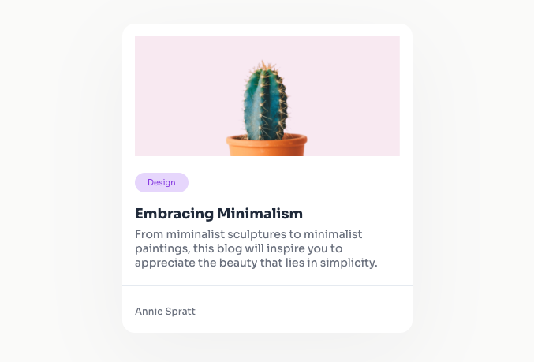

# Minimal Blog Card

## Overview

This project is a front-end challenge focused on creating a minimalistic blog card. It showcases the use of HTML and CSS, emphasizing responsive design and modern web styling practices.

## Technologies

-   **HTML**: For structuring the content of the blog card.
-   **CSS**: For styling, including CSS variables for maintainable and consistent design.
-   **Google Fonts (Sora)**: To enhance typography.

## Features

-   Responsive design for various screen sizes.
-   Clean and minimalistic UI.

## Setup

Clone the repository and open the `index.html` file in a web browser to view the project.

## Reflection

This challenge allowed me to improve my responsive design skills and reinforced the importance of clean, organized code for efficient web development.
